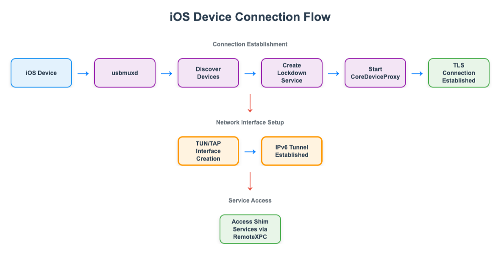

# appium-ios-remotexpc

A Node.js library for interacting with iOS devices
through Appium using remote XPC services.
This library enables communication with iOS devices
through various services like system logs and network tunneling.

## Overview

This library provides functionality for:

- Remote XPC (Cross Process Communication) with iOS devices
- Lockdown communication
- Device multiplexing via **usbmuxd** (lists USB **and** WiFi-attached devices; see below)
- Property list (plist) handling
- IPv6 tunneling services to iOS devices using TUN/TAP interfaces
- System log access

## Installation

```bash
npm install appium-ios-remotexpc
```

### Optional: CodeGraph for local code navigation

If you want a local semantic index for this repository, you can install [CodeGraph](https://github.com/colbymchenry/codegraph) locally and initialize it in the repo:

```bash
curl -fsSL https://raw.githubusercontent.com/colbymchenry/codegraph/main/install.sh | sh
cd "<project folder>"
codegraph install
codegraph init
```

CodeGraph builds a local knowledge graph of symbols and call paths so AI coding agents, like Cursor or Claude, can answer questions and navigate the codebase faster with fewer file reads and reduced token consumption.

## Requirements

- Node.js 20 or later
- iOS device for testing
- Proper device pairing and trust setup
- Root/sudo privileges for tunnel creation (TUN/TAP interface requires elevated permissions)

## Features

- **Plist Handling**: Encode, decode, parse, and create property lists for iOS device communication.
- **Device communication over usbmux / usbmuxd**: The system **usbmuxd** daemon exposes a single device list that includes machines plugged in over **USB** and, when pairing and wireless sync are set up, the same iPhone/iPad **over WiFi**. WiFi entries are marked **`ConnectionType: Network`** (USB entries use `ConnectionType: USB`). This library connects through usbmuxd the same way for both; the tunnel path is unchanged (lockdown → CoreDeviceProxy → TUN/TAP → Remote XPC).
- **Remote XPC**: Establish Remote XPC connections with iOS devices.
- **Service Architecture**: Connect to various iOS services:
    - System Log Service: Access device logs
    - Tunnel Service: Network tunneling to/from iOS devices
    - Diagnostic Service: Device diagnostics
    - AFC Service: File system operations on iOS devices
- **Pair Record Management**: Read and write device pairing records.
- **Packet Streaming**: Stream packets between host and device for service communication.

## Configuration

### Environment Variables

#### APPIUM_IOS_REMOTEXPC_LOG_LEVEL

Controls the logging verbosity of the library.

- **Default**: `info`
- **Possible values**: Standard log levels supported by @appium/support logger
  - `silly` - Most verbose, logs everything
  - `verbose` - Very detailed logs
  - `debug` - Detailed debugging information
  - `info` - General informational messages (default)
  - `warn` - Warning messages
  - `error` - Error messages only
- **Usage**:

```bash
# Set log level to debug for verbose output
APPIUM_IOS_REMOTEXPC_LOG_LEVEL=debug npm test

# Set log level to error for minimal output
APPIUM_IOS_REMOTEXPC_LOG_LEVEL=error node your-script.js
```

This is particularly useful for debugging issues or reducing log noise in production environments.

## Architecture Flow

The following diagram illustrates the high-level flow of how the tunnel is created:

<div align="center">
  
</div>

### Role of TUN/TAP

The `appium-ios-tuntap (previously tuntap-bridge)` module plays a crucial role in establishing network connectivity:

1. **TLS Socket Input**: Receives the secure TLS socket connection from CoreDeviceProxy
2. **Virtual Network Interface**: Creates a TUN/TAP virtual network interface on the host system
3. **IPv6 Tunnel**: Establishes an IPv6 tunnel between the host and iOS device
4. **Packet Routing**: Routes network packets between the virtual interface and the iOS device
5. **Service Access**: Enables access to iOS shim services through the tunnel

**Technical Details:**
- **Platform Support**: Works on both macOS and Linux
- **IPv6 Support**: Creates IPv6 tunnels for modern iOS communication
- **Packet Handling**: Manages packet routing between virtual interface and device
- **Automatic Cleanup**: Properly closes tunnels and cleans up interfaces

**Security Considerations:**
- Requires root/sudo access for TUN/TAP interface creation
- Uses TLS for secure communication with iOS devices

## Usage

### Creating a Tunnel (Low-level approach)

```typescript
import {
  createLockdownServiceByUDID,
  rsdSessionLockKey,
  startCoreDeviceProxyTcp,
  TunnelManager,
} from 'appium-ios-remotexpc';

// Create lockdown service
const { lockdownService, device } = await createLockdownServiceByUDID(udid);

// Start CoreDeviceProxy (raw TCP; TLS handled in native forwarder)
const { socket, cert, key } = await startCoreDeviceProxyTcp(
  lockdownService,
  device.DeviceID,
  device.Properties.SerialNumber,
);

// Create tunnel using tuntap
const tunnel = await TunnelManager.getTunnel(socket, { cert, key });
console.log(`Tunnel created at ${tunnel.Address} with RSD port ${tunnel.RsdPort}`);

// Discover RSD services (serialized per tunnel; closed before return)
await TunnelManager.runSerializedRsdSession(
  rsdSessionLockKey(tunnel.Address, tunnel.RsdPort),
  async () => {
    const remoteXPC = await TunnelManager.connectRemoteXPCUnlocked(
      tunnel.Address,
      tunnel.RsdPort,
    );
    try {
      console.log(remoteXPC.getServices());
    } finally {
      await remoteXPC.close();
    }
  },
);
```

### iPhone / iPad over WiFi (usbmuxd “network” devices)

**usbmuxd** (the multiplexer daemon, e.g. on macOS) does **not** only list USB devices: once a device is paired with the host and wireless sync / lockdown-over-WiFi is enabled, **the same daemon’s device list includes that device as attached over WiFi**. In plist responses from `ListDevices`, those rows carry **`ConnectionType: Network`** (and a distinct `DeviceID` from any USB listing for the same physical device).

There is no separate “WiFi API” in this library: call `createUsbmux()` → `listDevices()` (or any other client that queries **usbmuxd**) and use the returned **`DeviceID`** and UDID with `createLockdownServiceByUDID` and the tunnel steps in the previous section—identical to USB.

**Typical host-side setup:**

1. Pair the device with this Mac and tap **Trust** on the device if prompted.
2. Allow the device to connect over WiFi (e.g. in Finder under the device, enable **Show this [device] when on WiFi**, or use Xcode **Devices and Simulators** with the equivalent option so lockdown can reach the device without USB).
3. Confirm **usbmuxd** reports the device with **`ConnectionType: Network`**—for example by logging the result of `listDevices()` from this library, or by checking another usbmuxd client’s device list while the device is on the same network and not on USB.

For an end-to-end tunnel smoke test with the tunnel registry HTTP API, use `npm run tunnel-creation` or `npm run test:tunnel-creation` (see `scripts/test-tunnel-creation.ts`), usually with **sudo** for TUN/TAP.

### Apple TV / tvOS over WiFi

Apple TV and tvOS devices over WiFi are supported. The following symbols are part of the public API and are intended for external use (e.g. by the Appium XCUITest driver):

```typescript
import {
  AppleTVPairingService,
  UserInputService,
  AppleTVTunnelService,
} from 'appium-ios-remotexpc';

const userInput = new UserInputService();
const pairing = new AppleTVPairingService(userInput);
const result = await pairing.discoverAndPair('Living Room');
```

For step-by-step pairing instructions, see the [Apple TV Pairing Instructions](docs/apple-tv-pairing-guide.md).

## Development

### Setup

```bash
# Clone the repository
git clone https://github.com/yourusername/appium-ios-remotexpc.git
cd appium-ios-remotexpc

# Install dependencies
npm install

# Build the project
npm run build
```

### Continuous Integration

This project uses GitHub Actions for continuous integration and Dependabot for dependency management:

- **Lint and Build**: Automatically runs linting and builds the project on Node.js LTS.
- **Format Check**: Ensures code formatting adheres to project standards
- **Test Validation**: Validates that test files compile correctly (actual tests require physical devices)
- **Dependabot**: Automatically creates PRs for dependency updates weekly

All pull requests must pass these checks before merging. The workflows are defined in the `.github/workflows` directory.

### Scripts

- `npm run build` - Clean and build the project
- `npm run lint` - Run lint
- `npm run format` - Run format
- `npm run lint:fix` - Run lint with auto-fix
- `npm test` - Run tests (requires sudo privileges for tunneling)

CLI helpers under `scripts/` are ESM (`.mjs`) and load the library via the package entrypoint. Run `npm run build` before using them so `appium-ios-remotexpc` resolves to `build/`.

- `npm run tunnel-creation` / `npm run test:tunnel-creation` — Create USB tunnels and start the tunnel registry HTTP API (requires `sudo`)
- `npm run test:tunnel-creation:lsof` — Same as above with `--keep-open` (for inspecting open sockets)
- `npm run pair-appletv` — Pair an Apple TV over WiFi for Remote XPC (requires `sudo`)
- `npm run start-appletv-tunnel` — Start an Apple TV WiFi tunnel and tunnel registry (requires `sudo`)

Pass `--help` after `--` to any of these npm scripts to see CLI flags (for example: `npm run pair-appletv -- --help`).

## Project Structure

- `/scripts` - Optional CLI helpers (ESM `.mjs`) for tunnels and Apple TV pairing; use via `npm run` entries under [Scripts](#scripts)
- `/src` - Source code
  - `/lib` - Core libraries
    - `/lockdown` - Device lockdown protocol
    - `/pair-record` - Pairing record handling
    - `/plist` - Property list processing
    - `/remote-xpc` - XPC connection handling
    - `/tunnel` - Tunneling implementation with tuntap integration
    - `/usbmux` - usbmuxd client (USB and WiFi-listed devices)
  - `/services` - Service implementations
    - `/ios`
      - `/diagnostic-service` - Device diagnostics
      - `/syslog-service` - System log access
      - `/tunnel-service` - Network tunneling

## Testing

```bash
# Run all tests
npm test
```

Note: Integration tests require:
- Physical iOS devices connected (USB and/or **WiFi** if the device is paired and visible to usbmux as `Network`)
- Sudo privileges for tunnel creation
- Device trust established

## License

Apache-2.0

## Contributing

Contributions are welcome! Please feel free to submit a Pull Request.

## Notes

This project is under active development. APIs may change without notice.
